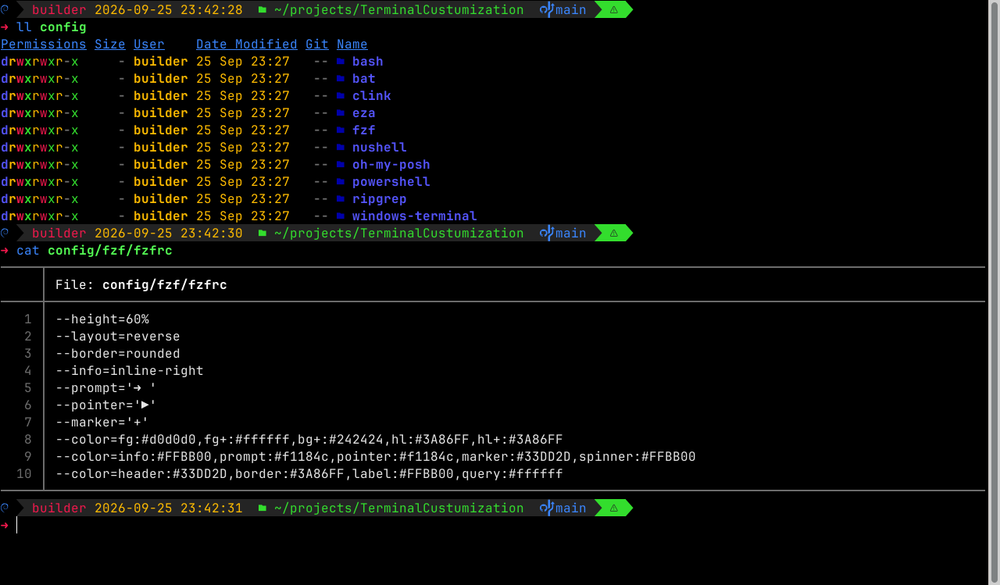
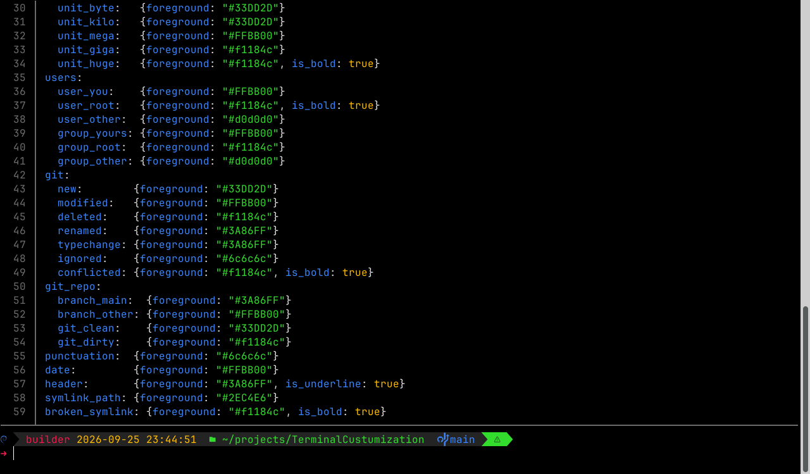
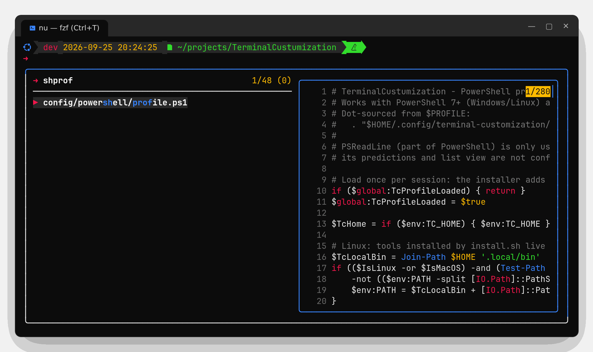
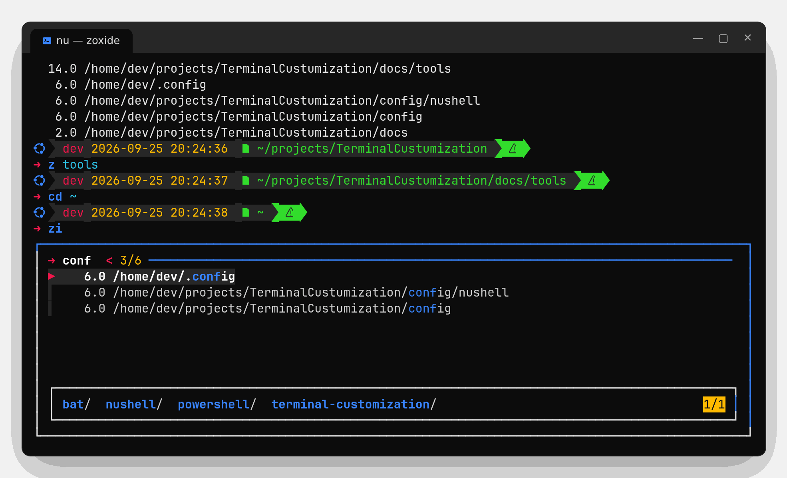
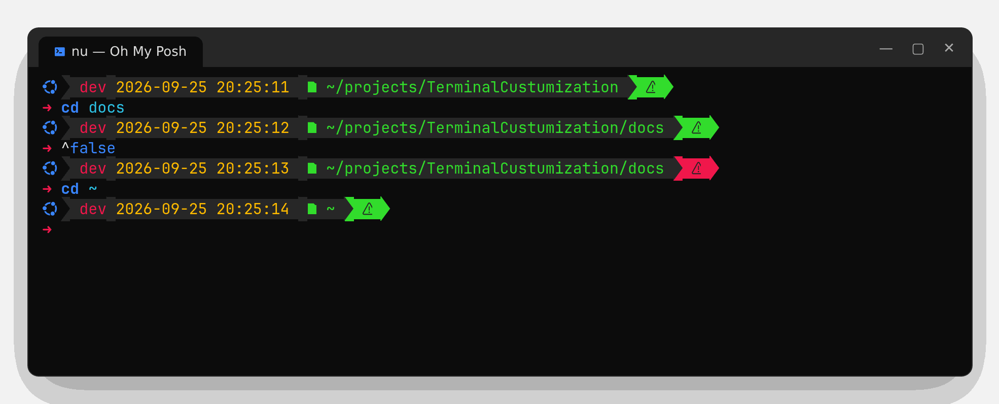

# Terminal Customization

A modern, consistent terminal on **Windows** and **Linux**: an Oh My Posh prompt, Nushell as the
default shell, and a set of fast CLI tools that all share the same *microverse-power* colour palette.



<details>
<summary>More screenshots: PowerShell 7, fzf, zoxide, Oh My Posh status</summary>

| PowerShell 7 (same profile on Windows and Linux) | fzf file picker (`Ctrl+T`) with bat preview |
|---|---|
|  |  |
| **zoxide** `z` / `zi` | **Oh My Posh** prompt, red status after a failed command |
|  |  |

Every [tool guide](docs/tools/README.md) has its own screenshot.
</details>

- [What gets installed](#what-gets-installed)
- [One-click install](#one-click-install)
- [Manual installation – Windows](#manual-installation--windows)
- [Manual installation – Linux](#manual-installation--linux)
- [Visual Studio 2026 developer shells](#visual-studio-2026-developer-shells)
- [Upgrading](#upgrading) · [Uninstalling](#uninstalling) · [Troubleshooting](#troubleshooting)
- [Tool guides](docs/tools/README.md)

## What gets installed

| Tool | Purpose | Guide |
|------|---------|-------|
| [Oh My Posh](https://ohmyposh.dev) | prompt theme engine (theme: *microverse-power*) | [guide](docs/tools/oh-my-posh.md) |
| [Nushell](https://www.nushell.sh) | structured-data shell, **opens by default** in new terminals | [guide](docs/tools/nushell.md) |
| [JetBrainsMono Nerd Font](https://www.nerdfonts.com) | font with the icons used by the prompt and eza | [Fonts](#3-font) |
| [eza](https://github.com/eza-community/eza) | `ls` with icons, git status, tree view | [guide](docs/tools/eza.md) |
| [bat](https://github.com/sharkdp/bat) | `cat` with syntax highlighting | [guide](docs/tools/bat.md) |
| [ripgrep](https://github.com/BurntSushi/ripgrep) | very fast recursive search (`rg`) | [guide](docs/tools/ripgrep.md) |
| [fzf](https://github.com/junegunn/fzf) | fuzzy finder for history, files and directories | [guide](docs/tools/fzf.md) |
| [zoxide](https://github.com/ajeetdsouza/zoxide) | smarter `cd` (`z`, `zi`) | [guide](docs/tools/zoxide.md) |
| [duf](https://github.com/muesli/duf) | disk free overview (`df`) | [guide](docs/tools/duf.md) |
| [dust](https://github.com/bootandy/dust) | disk usage tree (`du`) | [guide](docs/tools/dust.md) |
| [GitHub CLI](https://cli.github.com) | GitHub from the terminal (`gh`) | [guide](docs/tools/gh.md) |
| Windows only: [Windows Terminal](https://github.com/microsoft/terminal), [PowerShell 7](https://github.com/PowerShell/PowerShell) | terminal and modern PowerShell | |

**Changes compared to the previous version of this repo**

- PSReadLine and Terminal-Icons are no longer used. fzf (history, files, directories), zoxide (jumping)
  and eza (icons) replace them. The installer tells you when the PowerShell Gallery copies from the old setup
  are still installed; `-RemoveOldModules` uninstalls them. The copy of PSReadLine that ships inside PowerShell
  can't be removed; this setup simply doesn't configure it.
- The bundled Nerd Font v2 files are gone. The latest JetBrainsMono Nerd Font (v3, family name
  `JetBrainsMono Nerd Font`) is downloaded instead.
- Oh My Posh no longer ships themes in `POSH_THEMES_PATH`/`~/.poshthemes`. The theme is now kept in this repo.
- All configuration lives in [`config/`](config) and is shared by bash, PowerShell (5.1 and 7) and Nushell.

### Keyboard shortcuts and aliases

| Shortcut / alias | Action | Shells |
|------------------|--------|--------|
| `Ctrl+R` | fuzzy search history | bash, Nushell, PowerShell |
| `Ctrl+T` | fuzzy pick files (bat preview) | bash, Nushell, PowerShell |
| `Alt+C` | fuzzy `cd` into a sub-directory | bash, Nushell, PowerShell |
| `tc-doctor` | shows what the setup loaded in this session (profiles, tools, aliases, key bindings) | PowerShell |
| `z <name>` / `zi` | jump to a frequently used directory | all |
| `ll`, `la`, `lt` | eza: long, long + hidden, tree | all |
| `ls` / `l` | native listing / eza icons | bash, cmd.exe: `ls` is eza. Nushell, PowerShell: `ls` stays native (structured, pipeable), use `l` for eza |
| `cat` | bat | all |
| `df` / `du` | duf / dust | all (Nushell keeps its own `du`) |
| `rgf <pattern>` | ripgrep + fzf, opens the match in VS Code | PowerShell |

In **cmd.exe** (including the Visual Studio Developer Command Prompt), [Clink](https://github.com/chrisant996/clink) provides
the Oh My Posh prompt, the `ls`/`ll`/`la`/`lt`/`cat`/`df`/`du` aliases and `z`/`zi`. Its own history search is `Ctrl+R`
and `F7`.

## One-click install

The installers are safe to run again. A second run only adds what is **missing** and never duplicates anything:

- **Tools:** a tool that is already at the latest version is skipped, wherever it is installed. An outdated
  one is upgraded. On Windows, winget-managed packages are upgraded in place, and a tool installed some other
  way (scoop, choco, by hand) is left alone instead of being installed a second time.
- **Font:** it is only installed when missing. The [upgrade scripts](#upgrading) refresh it
  (`--update-fonts` / `-UpdateFonts`).
- **Shell configuration:** your files are never overwritten. Exactly one marked block
  (`# >>> terminal-customization >>>`) is added, and it is replaced in place on later runs. Statements elsewhere in
  the file that would load a tool a second time are disabled (kept as comments) and the file is backed up. This
  covers the old README's `oh-my-posh init` line, `zoxide init` / `fzf --bash` lines, the old
  PSReadLine/Terminal-Icons lines and hand-added copies of the source line. Statements that span several lines are
  disabled as a whole: PowerShell profiles are read with the PowerShell parser. Anything that can't be disabled
  cleanly is reported instead of half-commented. Your own PSReadLine settings (`-Colors`, `-BellStyle`, …) are kept.
  In bash, disabled lines become `: # disabled by terminal-customization: …`, which stays valid inside an `if … fi`.
- **Files are edited in place:** a `~/.bashrc` or profile that is a symlink (stow, chezmoi, …) stays a symlink,
  and a private file (mode 600) stays private.
- **Backups:** a `*.tc-backup-<date>` copy is kept only when a file actually changes.
- **Default shell:** your choice is kept.

### Security

- **Checksums:** on Linux every download is checked against the SHA-256 that GitHub publishes for the release asset,
  or the project's own checksum file. A mismatch deletes the download. A tool without any published checksum is
  **not installed** unless you pass `--allow-unverified`. Oh My Posh is downloaded as its release binary and checked
  the same way; no install script is piped into a shell. On Windows, winget verifies every package's hash itself.
- **GitHub token:** `GITHUB_TOKEN` is optional and only sent to the GitHub API. It is passed to `curl` through a
  private header file, never on the command line (so it doesn't show up in `ps`).
- **Execution policy:** `install.ps1` changes the policy only when it is still the untouched Windows default
  (`Restricted`), and only to `RemoteSigned` for your user in Windows PowerShell 5.1. A policy you or an
  administrator set (`AllSigned`, group policy, …) is never changed; the script tells you it blocks the profile.
  `-KeepExecutionPolicy` means "never change it".
- **Only undo what it did:** the installers record what they install in an *install record*
  (`~/.local/state/terminal-customization/manifest`, or `%LOCALAPPDATA%\terminal-customization\manifest.txt`).
  The uninstallers remove only what is in it: never a tool, winget package or font you already had. On Linux, a
  file in `~/.local/bin` that the installer didn't put there is not overwritten unless you pass `--force`; with
  `--force` it is backed up, and the uninstaller puts it back.
- **Read before you run:** the one-liners below are convenient. To review a script first, download it, read it,
  then run it:

  ```bash
  curl -fsSLO https://raw.githubusercontent.com/R3start/TerminalCustumization/main/install.sh
  less install.sh && bash install.sh
  ```
  ```powershell
  irm https://raw.githubusercontent.com/R3start/TerminalCustumization/main/install.ps1 -OutFile install.ps1
  notepad install.ps1; powershell -ExecutionPolicy Bypass -File .\install.ps1
  ```

### Windows 10/11

Open **PowerShell** (no admin rights needed) and run:

```powershell
irm https://raw.githubusercontent.com/R3start/TerminalCustumization/main/install.ps1 | iex
```

Or from a clone: `.\install.ps1` (if blocked: `powershell -ExecutionPolicy Bypass -File .\install.ps1`).

Options (from a clone, or with `& ([scriptblock]::Create((irm <url>))) -Option`):

| Option | Effect |
|--------|--------|
| `-SkipTools` | don't install/upgrade anything with winget |
| `-SkipFonts` | don't install the Nerd Font |
| `-UpdateFonts` | reinstall the font even if it is already installed |
| `-SkipConfig` | only install tools and font |
| `-NoDefaultShell` | don't start Nushell automatically: PowerShell windows stay PowerShell, and on a first install your default Windows Terminal profile is kept |
| `-DefaultShell` | start Nushell automatically again: PowerShell windows open Nushell and **Nushell (Microverse)** becomes the default profile (re-runs keep your choice otherwise) |
| `-RemoveOldModules` | uninstall the PSReadLine/Terminal-Icons copies from the PowerShell Gallery that the old setup used (otherwise only reported) |
| `-KeepExecutionPolicy` | never change the execution policy, only report when it blocks the profile |

What it does:
1. Installs the missing ones of Windows Terminal, PowerShell 7, Oh My Posh, Nushell, eza, bat, ripgrep, fzf,
   zoxide, duf, dust, gh and Clink with `winget install`. Packages winget already manages get `winget upgrade`.
2. Runs `oh-my-posh font install JetBrainsMono` if the font isn't installed yet.
3. Copies `config/` to `%USERPROFILE%\.config\terminal-customization`.
4. Adds one line to the end of `$PROFILE` (`Microsoft.PowerShell_profile.ps1`, the file PowerShell consoles load) and
   to `profile.ps1` (all hosts, e.g. VS Code), for PowerShell 7 and Windows PowerShell 5.1. The paths are asked from
   PowerShell itself, so a moved or OneDrive-redirected Documents folder is handled, and the setup loads only once.
   Those profiles apply to all hosts, including the VS Code terminal. It also disables the old
   PSReadLine/Terminal-Icons/oh-my-posh/zoxide statements in all profile files. If the profile can't run because of the
   execution policy, the policy is changed only if it is the untouched Windows default (see [Security](#security)).
   A PowerShell window opened normally (Start menu, a PowerShell tab) then **switches to Nushell**, like bash on Linux.
   PowerShell started to run something (`-Command`, `-File`: the Visual Studio Developer PowerShell, VS Code, scripts)
   stays PowerShell, and so does `powershell` typed inside Nushell. `TC_NO_NU=1` or `-NoDefaultShell` turn it off.
   The profile also adds missing machine/user PATH entries. A window opened by a program that was already running during
   the install (Visual Studio, an old Explorer) still finds the new tools.
5. Configures Nushell, the bat theme and **cmd.exe**: Clink autorun and the
   [`terminal-customization.lua`](config/clink/terminal-customization.lua) script.
6. Adds a **Nushell (Microverse)** Windows Terminal profile with the Microverse colour scheme and the Nerd Font,
   and makes it the default profile (first install only, or with `-DefaultShell`). If the profile defaults in
   `settings.json` are still empty, it also sets the Nerd Font for all other profiles (PowerShell, Command Prompt,
   the Visual Studio developer shells).

### Linux (x86_64 / aarch64, any distribution)

Requires `curl`, `tar` and `sha256sum` (or `shasum`). No root access is needed.

```bash
curl -fsSL https://raw.githubusercontent.com/R3start/TerminalCustumization/main/install.sh | bash
```

Or from a clone: `./install.sh`. Pass options with `curl … | bash -s -- --option`:

| Option | Effect |
|--------|--------|
| `--skip-tools` | don't download the tools |
| `--skip-fonts` | don't install the Nerd Font |
| `--update-fonts` | reinstall the font even if it is already installed |
| `--skip-config` | don't change any shell configuration |
| `--no-default-shell` | keep bash as the interactive shell |
| `--default-shell` | start Nushell automatically again (re-runs keep your current choice otherwise) |
| `--gnome-terminal` | also set the font and Microverse colours in the default GNOME Terminal profile |
| `--force` | reinstall tools and font even if the latest version is already installed, and replace files in `~/.local/bin` that the installer didn't put there (they are backed up and restored by the uninstaller) |
| `--allow-unverified` | install a tool even if no SHA-256 checksum is published for its download |
| `--dry-run` | print which release files would be downloaded |

`GITHUB_TOKEN=<token>` avoids GitHub API rate limits on shared networks. It also provides the GitHub asset
digests (the fallback without the API relies on the projects' checksum files).

What it does:
1. Downloads the latest release of each tool from GitHub (static musl builds where available), verifies its SHA-256
   and installs it into `~/.local/bin`. It skips tools that are already at the latest version, and never overwrites
   a file there that it didn't install. Oh My Posh is installed from its release binary the same way.
2. Runs `oh-my-posh font install JetBrainsMono` (into `~/.local/share/fonts`) if the font isn't installed yet.
3. Copies `config/` to `~/.config/terminal-customization`.
4. Adds one line to `~/.bashrc` and disables lines that would load a tool twice, such as an old `oh-my-posh init bash` line.
   Also sets up Nushell, the bat theme, and PowerShell if `pwsh` is installed.
5. New interactive terminals start Nushell automatically.

After installing, **select `JetBrainsMono Nerd Font` in your terminal's settings**. The Windows Terminal
profile and `--gnome-terminal` do this for you.

---

## Manual installation – Windows

Do everything in a normal (non-admin) PowerShell window unless noted. The file references below are to this repository.

### 1. Terminal and PowerShell 7

```powershell
winget install Microsoft.WindowsTerminal --source winget
winget install Microsoft.PowerShell --source winget
```

### 2. Tools

```powershell
winget install JanDeDobbeleer.OhMyPosh --source winget
winget install Nushell.Nushell         --source winget
winget install eza-community.eza       --source winget
winget install sharkdp.bat             --source winget
winget install BurntSushi.ripgrep.MSVC --source winget
winget install junegunn.fzf            --source winget
winget install ajeetdsouza.zoxide      --source winget
winget install muesli.duf              --source winget
winget install bootandy.dust           --source winget
winget install GitHub.cli              --source winget
```

Close and reopen the terminal so the new `PATH` is picked up.

### 3. Font

```powershell
oh-my-posh font install JetBrainsMono
```

Alternatively, download `JetBrainsMono.zip` from the latest [Nerd Fonts release](https://github.com/ryanoasis/nerd-fonts/releases/latest),
extract it, select all `.ttf` files, then right-click → **Install** (or **Install for all users**).

Then set the font in each terminal:
- **Windows Terminal**: *Settings → Profiles → Defaults → Appearance → Font face* → `JetBrainsMono Nerd Font`.
- **VS Code**: `"terminal.integrated.fontFamily": "JetBrainsMono Nerd Font"` in `settings.json`.

### 4. Shared configuration files

Copy the repo's `config` folder to `%USERPROFILE%\.config\terminal-customization`:

```powershell
git clone https://github.com/R3start/TerminalCustumization.git
New-Item -ItemType Directory "$HOME\.config" -Force | Out-Null
Copy-Item -Recurse -Force .\TerminalCustumization\config "$HOME\.config\terminal-customization"
```

### 5. PowerShell profile

Allow local scripts once: `Set-ExecutionPolicy RemoteSigned -Scope CurrentUser`.

Open your profile (`notepad $PROFILE`, usually `Documents\PowerShell\Microsoft.PowerShell_profile.ps1`; create it with
`New-Item -Force $PROFILE` if it doesn't exist) and add this line **at the end**:

```powershell
. "$HOME\.config\terminal-customization\powershell\profile.ps1"
```

Do this in both PowerShell 7 and Windows PowerShell 5.1 if you use both. For VS Code's PowerShell terminal, add the same
line to `$PROFILE.CurrentUserAllHosts`. The setup loads only once even when several profile files include it.
Remove any old `Import-Module PSReadLine`, `Set-PSReadLineOption`, `Import-Module Terminal-Icons` and
`oh-my-posh init` lines from `$PROFILE`. To also remove the modules the old setup installed:

```powershell
Uninstall-Module PSReadLine -AllVersions -Force      # only the PowerShell Gallery copy
Uninstall-Module Terminal-Icons -AllVersions -Force
```

What [`profile.ps1`](config/powershell/profile.ps1) does, if you prefer to copy only parts of it:

```powershell
oh-my-posh init pwsh --config "$HOME\.config\terminal-customization\oh-my-posh\microverse-power.omp.json" | Invoke-Expression
$env:EZA_CONFIG_DIR        = "$HOME\.config\terminal-customization\eza"
$env:FZF_DEFAULT_OPTS_FILE = "$HOME\.config\terminal-customization\fzf\fzfrc"
$env:RIPGREP_CONFIG_PATH   = "$HOME\.config\terminal-customization\ripgrep\ripgreprc"
$env:BAT_THEME             = 'Microverse'
function l { eza --icons=auto --group-directories-first @args }   # ls stays native Get-ChildItem
Remove-Item Alias:cat -Force; function cat { bat --paging=never @args }
function df { duf @args }; function du { dust @args }
gh completion -s powershell | Out-String | Invoke-Expression
Invoke-Expression (& { (zoxide init powershell | Out-String) })   # keep last
# plus the fzf helpers fe, fcd, fh and rgf
```

### 6. bat theme

```powershell
New-Item -ItemType Directory "$(bat --config-dir)\themes" -Force | Out-Null
Copy-Item "$HOME\.config\terminal-customization\bat\themes\Microverse.tmTheme" "$(bat --config-dir)\themes\"
bat cache --build
```

### 7. Nushell

Run these **inside `nu`**:

```nu
mkdir ($nu.default-config-dir | path join autoload)
cp ~/.config/terminal-customization/nushell/terminal-customization.nu ($nu.default-config-dir | path join autoload)
config nu      # opens config.nu: paste the contents of config/nushell/config-snippet.nu at the end
```

[`config-snippet.nu`](config/nushell/config-snippet.nu) runs `oh-my-posh init nu`, `zoxide init nushell` and
`fzf --nushell` on every start, so the integrations always match the installed versions. Restart `nu`.

### 8. Make Nushell the default shell

Copy [`config/windows-terminal/terminal-customization.json`](config/windows-terminal/terminal-customization.json) to
`%LOCALAPPDATA%\Microsoft\Windows Terminal\Fragments\TerminalCustomization\`. This adds the **Nushell (Microverse)**
profile and the **Microverse** colour scheme. Restart Windows Terminal, then open *Settings → Startup → Default profile* →
**Nushell (Microverse)** → *Save*.

Then open the fragment copy and set `"commandline"` (and `"icon"`) to the **full path** of `nu.exe`. Find it with
`(Get-Command nu).Source`; it is usually `"C:\\Program Files\\nu\\bin\\nu.exe"`. The installer does this for you.
Windows Terminal starts profiles with the PATH it was launched with, so a bare `nu.exe` can fail with
*"error 2147942402 (0x80070002) when launching `nu.exe`"*.

Without the fragment, you can add a profile by hand: *Settings → Add a new profile → New empty profile*, command line
`"C:\Program Files\nu\bin\nu.exe"` (the full path from above), font `JetBrainsMono Nerd Font`.

VS Code: add `"terminal.integrated.defaultProfile.windows": "Nushell"` and a profile entry
`"terminal.integrated.profiles.windows": { "Nushell": { "path": "nu.exe" } }`.

PowerShell windows switch to Nushell through the profile from step 5. To keep PowerShell instead, create an empty
`%USERPROFILE%\.config\terminal-customization\no-nu` file (or set the environment variable `TC_NO_NU=1`).

### 9. cmd.exe and the Developer Command Prompt (Clink)

```powershell
winget install chrisant996.Clink --source winget
$clink = "${env:ProgramFiles(x86)}\clink\clink.bat"          # where the Clink setup installs it
& $clink autorun install -- --quiet                           # start Clink in every cmd.exe
& $clink installscripts "$HOME\.config\terminal-customization\clink"
```

Open a new Command Prompt. [`terminal-customization.lua`](config/clink/terminal-customization.lua) loads the prompt, the
aliases and `z`/`zi` ([`z.cmd`](config/clink/z.cmd), [`zi.cmd`](config/clink/zi.cmd)).

### 10. GitHub CLI

```powershell
gh auth login
```

---

## Manual installation – Linux

Most distribution packages are outdated or missing (for example `eza`, `dust` and `duf`, or `bat` installed as
`batcat`), so these steps use the official GitHub release binaries. Replace `x86_64`/`amd64` with
`aarch64`/`arm64` on ARM machines.

### 1. Tools

Make sure `~/.local/bin` exists and is in your `PATH`:

```bash
mkdir -p ~/.local/bin && export PATH="$HOME/.local/bin:$PATH"
```

Always check a download against the SHA-256 shown next to it on the release page. GitHub lists a
`sha256:…` digest for every asset, and most projects also publish a `checksums.txt` / `*.sha256` file.
`sha256sum -c` prints `OK` only when the file is intact.

**Oh My Posh** (release binary `posh-linux-amd64`, or `posh-linux-arm64`):

```bash
cd /tmp
curl -LO https://github.com/JanDeDobbeleer/oh-my-posh/releases/latest/download/posh-linux-amd64
echo "<sha256 from the release page>  posh-linux-amd64" | sha256sum -c -
install -m 755 posh-linux-amd64 ~/.local/bin/oh-my-posh
oh-my-posh version
```

**Everything else**: open each tool's *latest release* page, download the archive listed, check its SHA-256,
extract it, and copy the binary to `~/.local/bin`:

| Tool | Latest release | Archive (x86_64) | Binary |
|------|----------------|------------------|--------|
| Nushell | [nushell/nushell](https://github.com/nushell/nushell/releases/latest) | `nu-<ver>-x86_64-unknown-linux-musl.tar.gz` | `nu` |
| eza | [eza-community/eza](https://github.com/eza-community/eza/releases/latest) | `eza_x86_64-unknown-linux-musl.tar.gz` | `eza` |
| bat | [sharkdp/bat](https://github.com/sharkdp/bat/releases/latest) | `bat-v<ver>-x86_64-unknown-linux-musl.tar.gz` | `bat` |
| ripgrep | [BurntSushi/ripgrep](https://github.com/BurntSushi/ripgrep/releases/latest) | `ripgrep-<ver>-x86_64-unknown-linux-musl.tar.gz` | `rg` |
| fzf | [junegunn/fzf](https://github.com/junegunn/fzf/releases/latest) | `fzf-<ver>-linux_amd64.tar.gz` | `fzf` |
| zoxide | [ajeetdsouza/zoxide](https://github.com/ajeetdsouza/zoxide/releases/latest) | `zoxide-<ver>-x86_64-unknown-linux-musl.tar.gz` | `zoxide` |
| duf | [muesli/duf](https://github.com/muesli/duf/releases/latest) | `duf_<ver>_linux_x86_64.tar.gz` | `duf` |
| dust | [bootandy/dust](https://github.com/bootandy/dust/releases/latest) | `dust-v<ver>-x86_64-unknown-linux-musl.tar.gz` | `dust` |
| gh | [cli/cli](https://github.com/cli/cli/releases/latest) | `gh_<ver>_linux_amd64.tar.gz` | `bin/gh` |

Example for one tool:

```bash
cd /tmp
curl -LO https://github.com/eza-community/eza/releases/latest/download/eza_x86_64-unknown-linux-musl.tar.gz
echo "<sha256 from the release page>  eza_x86_64-unknown-linux-musl.tar.gz" | sha256sum -c -
tar -xzf eza_x86_64-unknown-linux-musl.tar.gz
install -m 755 eza ~/.local/bin/
eza --version
```

(`./install.sh --skip-fonts --skip-config` does exactly this for every tool, including the checksum check.)

### 2. Font

```bash
oh-my-posh font install JetBrainsMono
fc-cache -f
```

Alternatively, download `JetBrainsMono.tar.xz` from the latest [Nerd Fonts release](https://github.com/ryanoasis/nerd-fonts/releases/latest)
and extract it into `~/.local/share/fonts`. Then select **JetBrainsMono Nerd Font** in your terminal's preferences.
On WSL, install the font on **Windows** instead; the terminal runs there.

### 3. Shared configuration files

```bash
git clone https://github.com/R3start/TerminalCustumization.git
mkdir -p ~/.config/terminal-customization
cp -r TerminalCustumization/config/. ~/.config/terminal-customization/
```

### 4. bash

Add to the end of `~/.bashrc` and remove any old `oh-my-posh init bash --config ~/.poshthemes/...` line:

```bash
[ -f "$HOME/.config/terminal-customization/bash/terminal-customization.bash" ] && . "$HOME/.config/terminal-customization/bash/terminal-customization.bash"
```

[`terminal-customization.bash`](config/bash/terminal-customization.bash) initialises Oh My Posh, fzf (`eval "$(fzf --bash)"`),
zoxide and gh completion, and sets the eza/bat/duf/dust aliases. It also hands the terminal over to Nushell (see step 7).
Run `exec bash` to reload.

### 5. bat theme

```bash
mkdir -p "$(bat --config-dir)/themes"
cp ~/.config/terminal-customization/bat/themes/Microverse.tmTheme "$(bat --config-dir)/themes/"
bat cache --build
```

### 6. Nushell

Run these **inside `nu`**:

```nu
mkdir ($nu.default-config-dir | path join autoload)
cp ~/.config/terminal-customization/nushell/terminal-customization.nu ($nu.default-config-dir | path join autoload)
config nu      # paste the contents of config/nushell/config-snippet.nu at the end
```

### 7. Make Nushell the default shell

The bash config from step 4 runs `exec nu` in interactive terminals, so every new terminal opens Nushell.
Your login shell stays bash, so scripts, `ssh host command` and system tools keep working. To turn it off:

```bash
touch ~/.config/terminal-customization/no-nu     # permanently
TC_NO_NU=1 bash                                  # just this once
```

If you'd rather configure your terminal emulator, set its command to `nu` (for example in GNOME Terminal: *Preferences →
Profile → Command → Run a custom command instead of my shell* → `nu`).

### 8. Terminal colours (optional)

The Microverse palette as terminal colours (0–15):
`#242424 #F1184C #33DD2D #FFBB00 #3A86FF #B45CFF #2EC4E6 #D0D0D0 #6C6C6C #FF4D74 #66F060 #FFD24D #6FA8FF #CC8CFF #6FDAF2 #FFFFFF`,
background `#0C0C0C`, foreground `#E6E6E6`. `./install.sh --skip-tools --skip-fonts --gnome-terminal` applies them to GNOME Terminal.

### 9. PowerShell on Linux (optional)

If you use `pwsh`, add `. "$HOME/.config/terminal-customization/powershell/profile.ps1"` to `$PROFILE.CurrentUserAllHosts`.

### 10. GitHub CLI

```bash
gh auth login
```

---

## Visual Studio 2026 developer shells

Visual Studio's **Developer PowerShell** and **Developer Command Prompt** (Start menu, *Tools → Command Line*, the Visual
Studio terminal, and their Windows Terminal profiles) get the same setup:

- **Developer PowerShell** loads the PowerShell profile: Oh My Posh prompt, eza/bat/duf/dust aliases, `z`/`zi`, and the
  fzf key bindings Ctrl+T / Ctrl+R / Alt+C. If something is missing, run `tc-doctor` there. It stays PowerShell and doesn't switch to Nushell: Visual Studio starts it with `-Command Enter-VsDevShell …`,
  and switching would lose the build environment. Its Start-menu shortcut uses the 32-bit Windows PowerShell, which has
  its own execution policy; the installer checks that one too.
- **Developer Command Prompt** is `cmd.exe` with Clink: Oh My Posh prompt, `ls`/`ll`/`la`/`lt`/`cat`/`df`/`du`, `z`/`zi`.
- **Restart Visual Studio after installing.** It passes the PATH it started with to every shell it opens. The PowerShell
  profile adds the missing entries itself. The Command Prompt only sees the new tools after a restart.
- **Font:** Windows Terminal profiles get the Nerd Font through the profile defaults (see step 6 above). For Visual
  Studio's own terminal, choose *Tools → Options → Environment → Fonts and Colors → Show settings for: Terminal* →
  **JetBrainsMono Nerd Font**.

## Upgrading

Every tool is upgraded to its **latest release**, the JetBrainsMono Nerd Font is refreshed and the
configuration files in `~/.config/terminal-customization` are updated. Your own edits to those files are
kept as `*.tc-backup-<date>`, and your choice of default shell stays as it is.

### With the upgrade scripts

| | Command |
|-|---------|
| Windows | `irm https://raw.githubusercontent.com/R3start/TerminalCustumization/main/upgrade.ps1 \| iex` or `.\upgrade.ps1` |
| Linux | `curl -fsSL https://raw.githubusercontent.com/R3start/TerminalCustumization/main/upgrade.sh \| bash` or `./upgrade.sh` |

When run from a git clone, the scripts first `git pull --ff-only` the repository. They then run the installer
with `--update-fonts` / `-UpdateFonts` and finally print a *before → after* version table. They accept the installer's skip options
(`-SkipTools`, `-SkipFonts`, `-SkipConfig` / `--skip-tools`, `--skip-fonts`, `--skip-config`, `--force`).

### Manually – Windows

```powershell
# 1. tools (all winget packages, or one by one)
winget upgrade --all --source winget
winget upgrade --id JanDeDobbeleer.OhMyPosh --source winget      # etc. for each id in "Manual installation"

# 2. font
oh-my-posh font install JetBrainsMono

# 3. configuration: pull the repo and copy config/ again
git -C TerminalCustumization pull
Copy-Item -Recurse -Force .\TerminalCustumization\config\* "$HOME\.config\terminal-customization\"
bat cache --build                                                # if the bat theme changed
```

Nushell's integration scripts (Oh My Posh, zoxide, fzf) regenerate themselves on every start, so they
always match the upgraded tools. Restart the terminal afterwards.

### Manually – Linux

```bash
# 1. Oh My Posh
oh-my-posh upgrade            # or download the release binary again, as in "Manual installation – Linux"

# 2. every other tool: download the newest archive from its "latest release" page
#    (table in "Manual installation – Linux") and copy the binary over the old one, e.g.
curl -LO https://github.com/eza-community/eza/releases/latest/download/eza_x86_64-unknown-linux-musl.tar.gz
echo "<sha256 from the release page>  eza_x86_64-unknown-linux-musl.tar.gz" | sha256sum -c -
tar -xzf eza_x86_64-unknown-linux-musl.tar.gz && install -m 755 eza ~/.local/bin/

# 3. font
oh-my-posh font install JetBrainsMono && fc-cache -f

# 4. configuration
git -C TerminalCustumization pull
cp -r TerminalCustumization/config/. ~/.config/terminal-customization/
bat cache --build
```

Check the result with `eza --version`, `nu --version`, `oh-my-posh version`, and so on.

## Uninstalling

### With the uninstall scripts

| | Command |
|-|---------|
| Windows | `.\uninstall.ps1` or `& ([scriptblock]::Create((irm https://raw.githubusercontent.com/R3start/TerminalCustumization/main/uninstall.ps1))) -Yes` |
| Linux | `./uninstall.sh` or `curl -fsSL https://raw.githubusercontent.com/R3start/TerminalCustumization/main/uninstall.sh \| bash -s -- --yes` |

The scripts show what they will remove and ask for confirmation (`-Yes` / `--yes` skips the question). They remove:

- the `terminal-customization` blocks from `~/.bashrc`, the PowerShell profiles and Nushell's `config.nu`
  (each edited file is backed up as `*.tc-backup-<date>` first);
- the Nushell autoload scripts, the bat **Microverse** theme and `~/.config/terminal-customization`;
- Windows: the **Nushell (Microverse)** Windows Terminal profile. If it was the default, PowerShell becomes the default again;
- Windows: the Clink script registration and the Clink autorun (only if the installer turned it on), and the Nerd Font
  profile default in Windows Terminal (only if the installer set it);
- the tools **the installer installed**, as listed in its install record (see [Security](#security)).
  On Windows that is `winget uninstall` of the packages it installed; Windows Terminal and PowerShell 7 are always
  kept. On Linux it deletes the binaries it put in `~/.local/bin`, keeps any it finds you changed since, and puts
  back files that `install.sh --force` replaced. Tools you had before are never removed;
- the JetBrainsMono Nerd Font files the installer added (a font you installed yourself is kept).

| Windows | Linux | Keeps / also removes |
|---------|-------|----------------------|
| `-KeepTools` | `--keep-tools` | keep the tools |
| `-AllTools` | `--all-tools` | also remove this setup's tools that are **not** in the install record (for installs made before the record existed). Use with care: that includes copies you installed yourself |
| `-KeepFonts` | `--keep-fonts` | keep the font |
| `-KeepConfig` | `--keep-config` | keep `~/.config/terminal-customization` |
| `-Purge` | `--purge` | also delete zoxide's directory database and the Oh My Posh cache |
| – | `--gnome-terminal` | reset the GNOME Terminal font/colours set by `install.sh --gnome-terminal` |

Lines the installer disabled (`# disabled by terminal-customization: …`, in bash `: # disabled …`) are left alone;
restore them by hand if you want the old setup back. PSReadLine is part of PowerShell and simply returns to its defaults.

### Manually – Windows

1. **Profiles:** open `Documents\PowerShell\profile.ps1` and `Documents\WindowsPowerShell\profile.ps1` and delete the
   lines from `# >>> terminal-customization >>>` to `# <<< terminal-customization <<<`.
2. **Nushell:** in `nu`, run `config nu` and delete the same block. Then delete these files:
   ```nu
   rm ($nu.default-config-dir | path join autoload terminal-customization.nu) ($nu.default-config-dir | path join autoload zoxide.nu) ($nu.default-config-dir | path join autoload fzf.nu)
   rm ($nu.data-dir | path join vendor autoload oh-my-posh.nu)
   ```
3. **Windows Terminal:** *Settings → Startup → Default profile* → **PowerShell**, then delete
   `%LOCALAPPDATA%\Microsoft\Windows Terminal\Fragments\TerminalCustomization`.
4. **bat theme:** delete `%APPDATA%\bat\themes\Microverse.tmTheme` and run `bat cache --build`.
5. **Tools:**
   ```powershell
   'JanDeDobbeleer.OhMyPosh','Nushell.Nushell','eza-community.eza','sharkdp.bat','BurntSushi.ripgrep.MSVC',
   'junegunn.fzf','ajeetdsouza.zoxide','muesli.duf','bootandy.dust','GitHub.cli' |
       ForEach-Object { winget uninstall --id $_ --exact }
   ```
6. **Font:** *Settings → Personalization → Fonts* → search "JetBrainsMono" → each **JetBrainsMono Nerd Font** entry → *Uninstall*.
7. **cmd.exe:** `clink uninstallscripts "$HOME\.config\terminal-customization\clink"`, and
   `clink autorun uninstall` if you don't want Clink in cmd.exe any more. Then `winget uninstall chrisant996.Clink`.
8. **Configuration:** `Remove-Item -Recurse "$HOME\.config\terminal-customization"`.

### Manually – Linux

1. **bash:** delete the `# >>> terminal-customization >>>` … `# <<< terminal-customization <<<` block from `~/.bashrc`.
2. **Nushell:** `config nu` → delete the same block. Then:
   ```nu
   rm ($nu.default-config-dir | path join autoload terminal-customization.nu) ($nu.default-config-dir | path join autoload zoxide.nu) ($nu.default-config-dir | path join autoload fzf.nu)
   rm ($nu.data-dir | path join vendor autoload oh-my-posh.nu)
   ```
3. **PowerShell (if used):** delete the block from `~/.config/powershell/profile.ps1`.
4. **bat theme:** `rm "$(bat --config-dir)/themes/Microverse.tmTheme" && bat cache --build`
5. **Tools:** `cd ~/.local/bin && rm -f oh-my-posh nu nu_plugin_* eza bat rg fzf zoxide duf dust gh`
6. **Font:** `rm -f ~/.local/share/fonts/JetBrainsMono*NerdFont* && fc-cache -f`
7. **Configuration:** `rm -rf ~/.config/terminal-customization`
8. Optional data: `rm -rf ~/.local/share/zoxide ~/.cache/oh-my-posh`

## Troubleshooting

| Problem | Fix |
|---------|-----|
| Squares or `?` instead of icons | Select **JetBrainsMono Nerd Font** in the terminal settings. On WSL/SSH, install the font on the machine running the terminal. |
| `command not found` right after installing | Open a new terminal. On Linux, check that `~/.local/bin` is in `PATH`. |
| PowerShell: "running scripts is disabled" | `Set-ExecutionPolicy RemoteSigned -Scope CurrentUser` |
| Want bash/PowerShell back as the default | Linux: `./install.sh --skip-tools --skip-fonts --no-default-shell` (or `touch ~/.config/terminal-customization/no-nu`). Windows: `.\install.ps1 -SkipTools -SkipFonts -NoDefaultShell` and pick another default profile in Windows Terminal. |
| A PowerShell window doesn't switch to Nushell | Only a normally opened PowerShell switches, not one started with `-Command`/`-File`. Check that `TC_NO_NU` isn't set and that `%USERPROFILE%\.config\terminal-customization\no-nu` doesn't exist. `Get-Command nu` must find Nushell. |
| PowerShell shows the old prompt | Run `Get-Content $PROFILE`. Old `oh-my-posh init …` lines outside the `terminal-customization` block should be commented out (`# disabled by terminal-customization`), and the block should be the last thing in the file. Re-run `install.ps1` if it isn't. |
| Something from the setup is missing in a PowerShell console | Run `tc-doctor` in that console. It shows why Nushell was or wasn't started, which profile files exist and contain the setup, where each tool was found (and older copies), whether `ls`/`cat`/`z`/… are this setup's commands, and whether Ctrl+T/R and Alt+C are bound. |
| Visual Studio Developer PowerShell shows an old prompt / no new tools | Restart Visual Studio so it gets the new PATH. `Get-Command oh-my-posh -All` shows every copy on PATH; uninstall an old one that comes first. |
| `install.sh` fails with HTTP 403 from api.github.com | GitHub rate limit: set `GITHUB_TOKEN` or wait an hour. The script also falls back to the release web pages. |
| winget errors on an old Windows 10 | Update **App Installer** from the Microsoft Store (<https://aka.ms/getwinget>). |
| Windows Terminal: `[error 2147942402 (0x80070002) when launching nu.exe]` | The profile can't find `nu.exe`. Run `install.ps1` again: it points the profile at the full path of `nu.exe`. If Nushell isn't installed, it switches the default profile back to PowerShell and tells you to run `winget install Nushell.Nushell`. By hand: *Settings → Nushell (Microverse) → Command line* → the output of `(Get-Command nu).Source` in quotes. |
| Nushell prompt has no theme | Oh My Posh needs Nushell ≥ 0.104: upgrade Nushell and re-run the installer. |

## Repository layout

```
install.ps1 / install.sh         one-click installers (Windows: winget, Linux: GitHub releases)
upgrade.ps1 / upgrade.sh         upgrade everything to the latest versions
uninstall.ps1 / uninstall.sh     remove everything the installers added
config/
  oh-my-posh/microverse-power.omp.json   prompt theme
  bash/terminal-customization.bash       bash config
  powershell/profile.ps1                 PowerShell 5.1/7 config
  powershell/disable-duplicates.ps1      disables duplicate profile statements (used by the installers)
  nushell/terminal-customization.nu      Nushell config (autoload)
  nushell/config-snippet.nu              block appended to config.nu
  bat/themes/Microverse.tmTheme          bat theme
  eza/theme.yml                          eza colours
  fzf/fzfrc                              fzf defaults and colours
  ripgrep/ripgreprc                      ripgrep defaults and colours
  windows-terminal/terminal-customization.json   Windows Terminal profile + colour scheme
  clink/terminal-customization.lua       cmd.exe (Clink): prompt, aliases, zoxide
  clink/z.cmd, clink/zi.cmd              z / zi for cmd.exe
docs/tools/                       one usage guide per tool
docs/images/                      screenshots
```

## License

[The Unlicense](LICENSE) (public domain)
