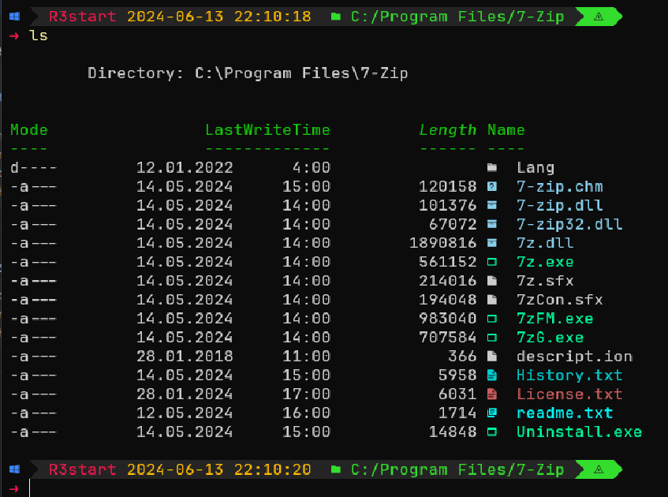

# Upgrading Terminal:
Example:



## Oh-My-Posh
The main component for upgrading terminal it is Oh-My-Posh.

Install OhMyPosh (https://ohmyposh.dev/):
#### Windows:
```ps
 winget install JanDeDobbeleer.OhMyPosh -s winget
```
#### Linux:
  ```bash
  # Download installer
  sudo wget https://github.com/JanDeDobbeleer/oh-my-posh/releases/latest/download/posh-linux-amd64 -O /usr/local/bin/oh-my-posh
  sudo chmod +x /usr/local/bin/oh-my-posh

  # Download and install themes
  mkdir ~/.poshthemes
  wget https://github.com/JanDeDobbeleer/oh-my-posh/releases/latest/download/themes.zip -O ~/.poshthemes/themes.zip
  unzip ~/.poshthemes/themes.zip -d ~/.poshthemes
  chmod u+rw ~/.poshthemes/*.omp.*
  rm ~/.poshthemes/themes.zip
  ```

## Fonts:
#### Windows:
   1. Download font from https://www.nerdfonts.com/font-downloads
   2. Select all fonts and RMB Install for all users

#### Linux:
```bash
oh-my-posh font install
```

## Initialize Oh-My-Posh on bash/powershell opening
#### Windows:
   Add initialization in PowerShell/Windows PowerShell
   You can find profile file location by writing `$PROFILE` in terminal
   Add `oh-my-posh init pwsh --config "$env:POSH_THEMES_PATH/craver.omp.json" | Invoke-Expression` to init Starship on each opening

   You can copy existing profiles from the Configs dir to `$PROFILE/Documents/`(Windows) or `$HOME\Documents\PowerShell\`

#### Linux
   Add initialization in the ./bashrc config
   ```bash
   nano ~/.bashrc
   # Add to file in the end:
   eval "$(oh-my-posh init bash --config ~/.poshthemes/craver.omp.json)"

   # Re open bash
   exec bash
   ```


## Install other modules (Windows)
### Terminal Icons module
   Install Powershell icons module:

   ```ps
   Install-Module -Name Terminal-Icons -Repository PSGallery -Scope CurrentUser
   ```
   Add module initialization to config:
   ```ps
   Import-Module -Name Terminal-Icons
   ```

###   Install autocomplete module (PSReadLine)
   Install powershell module:
   ```ps
   Install-Module PSReadLine -AllowPrerelease -Force
   ```
   Add to config:
   ```ps
   Import-Module PSReadLine
   Set-PSReadLineOption -PredictionSource History
   Set-PSReadLineOption -PredictionViewStyle ListView
   Set-PSReadLineOption -EditMode Windows
   ```
