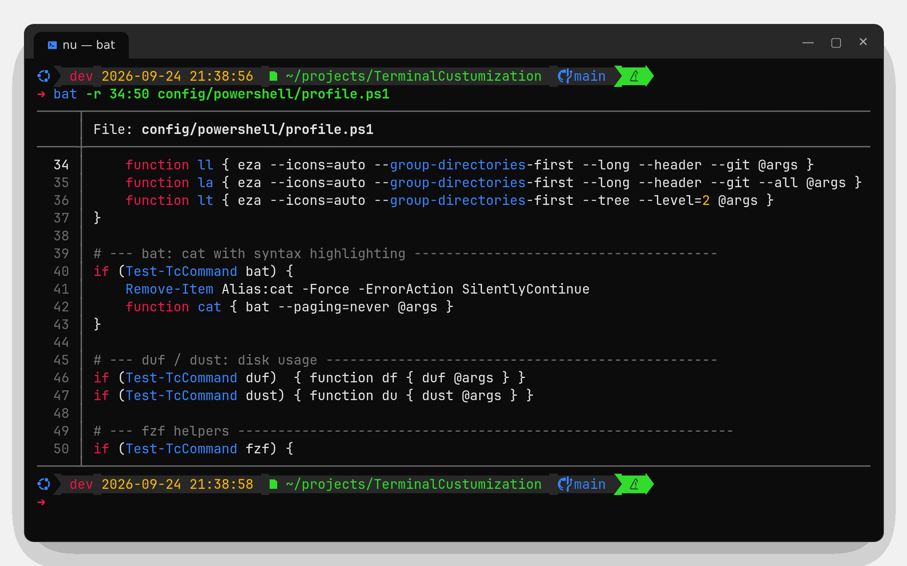

# bat – `cat` with wings

<https://github.com/sharkdp/bat>



bat prints files with syntax highlighting, line numbers and git change markers, and pages long output.

## Install

| | Command |
|-|---------|
| Windows | `winget install sharkdp.bat --source winget` |
| Linux | `bat-v<version>-<arch>-unknown-linux-musl.tar.gz` from the [latest release](https://github.com/sharkdp/bat/releases/latest) → `~/.local/bin` (Debian/Ubuntu's `apt` package is called `batcat`; the bash config handles that) |

## In this setup

- `cat` is aliased to `bat --paging=never` (bash, PowerShell, Nushell). Use `command cat` (bash) / `Get-Content` (PowerShell) / `^cat` (Nushell) for the original.
- bash uses bat as the man page viewer (`MANPAGER`).
- fzf previews files with bat.
- Theme **Microverse** ([`config/bat/themes/Microverse.tmTheme`](../../config/bat/themes/Microverse.tmTheme)) is selected with `BAT_THEME=Microverse`.

## Everyday commands

```bash
bat file.py                      # highlighted, paged
bat -p file.py                   # plain: no line numbers/header
bat -r 10:40 file.py             # only lines 10-40
bat -H 25 file.py                # highlight line 25
bat -l json < data.txt           # force a language
bat --diff file.py               # only lines changed vs. git
git show HEAD:file.py | bat -l py
bat --list-themes | fzf --preview 'bat --theme={} --color=always file.py'
```

## Installing the theme manually

```bash
mkdir -p "$(bat --config-dir)/themes"
cp config/bat/themes/Microverse.tmTheme "$(bat --config-dir)/themes/"
bat cache --build
bat --list-themes | grep Microverse
```
On Windows `bat --config-dir` is `%APPDATA%\bat`.
