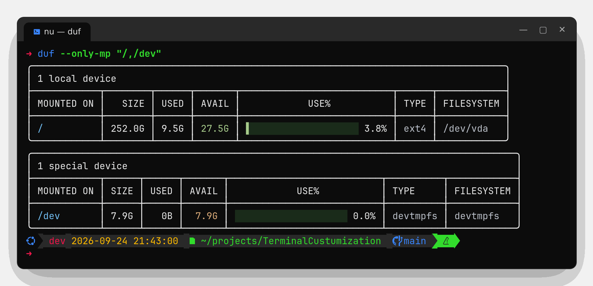

# duf – disk usage / free space

<https://github.com/muesli/duf>



duf shows mounted disks with used/free space as colourful tables. It is a friendlier `df`
and works the same on Windows and Linux.

## Install

| | Command |
|-|---------|
| Windows | `winget install muesli.duf --source winget` |
| Linux | `duf_<version>_linux_<x86_64\|arm64>.tar.gz` from the [latest release](https://github.com/muesli/duf/releases/latest) → `~/.local/bin` |

## In this setup

`df` is aliased to `duf` in bash, PowerShell and Nushell. `command df` (bash) calls the original.

## Everyday commands

```bash
duf                      # all local devices
duf /home /mnt/data      # only these paths
duf --only local,network # filter by device type
duf --hide-fs tmpfs,squashfs
duf --sort size          # sort by size (also used, avail, usage, mountpoint)
duf --inodes             # inode usage instead of blocks
duf --json               # machine readable
duf --theme light        # if colours look wrong on a light terminal
```
