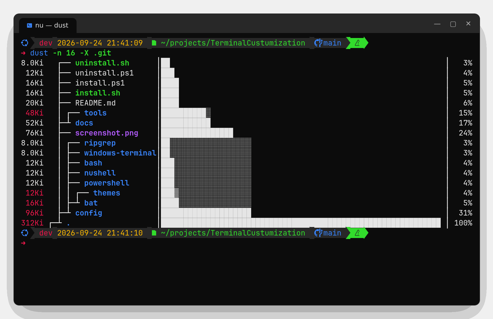

# dust – where did my disk space go?

<https://github.com/bootandy/dust>



dust (`du` + rust) shows the largest directories and files as a tree with bar charts.

## Install

| | Command |
|-|---------|
| Windows | `winget install bootandy.dust --source winget` |
| Linux | `dust-v<version>-<arch>-unknown-linux-musl.tar.gz` from the [latest release](https://github.com/bootandy/dust/releases/latest) → `~/.local/bin` |

## In this setup

`du` is aliased to `dust` in bash and PowerShell. Nushell keeps its structured built-in `du`; call `dust` directly there.
Use `command du` (bash) for the original.

## Everyday commands

```bash
dust                    # current directory
dust ~/Downloads        # a specific directory
dust -n 30              # show 30 entries
dust -d 1               # only one level deep
dust -r                 # reverse: biggest at the top
dust -X node_modules    # ignore a directory name
dust -t                 # group by file type
dust -f                 # count files instead of size
```
