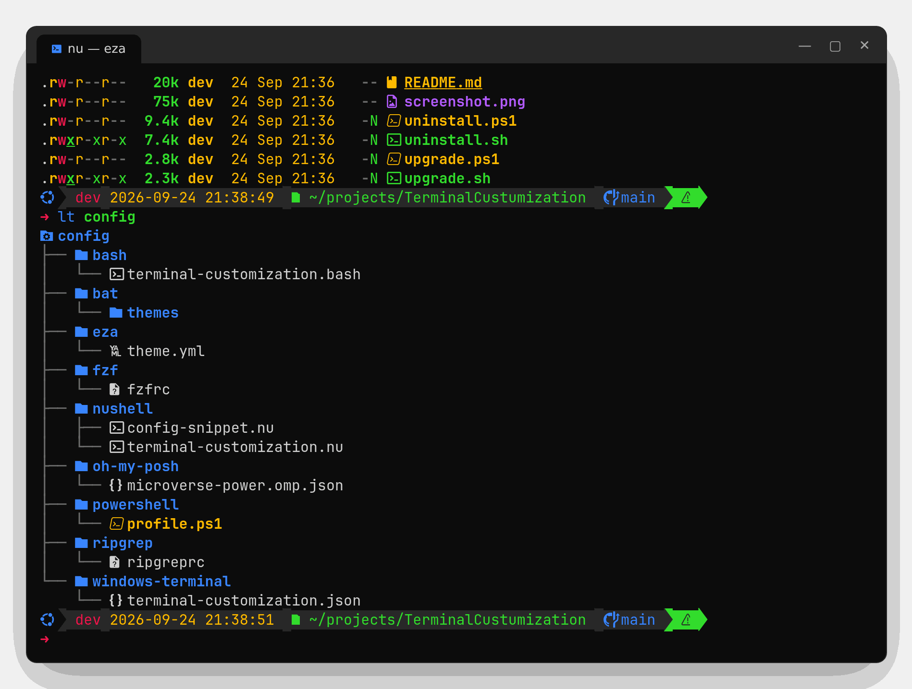

# eza – modern `ls`

<https://github.com/eza-community/eza> · <https://eza.rocks>



eza is a replacement for `ls` with colours, **Nerd Font icons**, git status and a tree view.
It replaces the old *Terminal-Icons* PowerShell module.

## Install

| | Command |
|-|---------|
| Windows | `winget install eza-community.eza --source winget` |
| Linux | `eza_<arch>-unknown-linux-musl.tar.gz` from the [latest release](https://github.com/eza-community/eza/releases/latest) → `~/.local/bin` |

## Aliases in this setup

| Alias | bash / PowerShell | Nushell |
|-------|-------------------|---------|
| `ls` | `eza --icons=auto --group-directories-first` | built-in `ls` (structured) |
| `l`  | – | `eza --icons=auto --group-directories-first` |
| `ll` | long listing with header and git status | same |
| `la` | `ll` + hidden files | same |
| `lt` | tree, 2 levels deep | same |

## Everyday commands

```bash
eza -l --git                 # long listing with git status column
eza -la --sort=modified      # newest last, including hidden files
eza -T -L 3 --git-ignore     # tree, 3 levels, skip files ignored by git
eza -l --total-size          # directory sizes (slower)
eza -D                       # only directories
eza --icons=always | less -R # keep icons when piping
```

## Theme

Colours come from [`config/eza/theme.yml`](../../config/eza/theme.yml) (microverse-power palette),
found through `EZA_CONFIG_DIR=~/.config/terminal-customization/eza`. Remove the variable to get the default colours.
Icons need a Nerd Font in the terminal.
