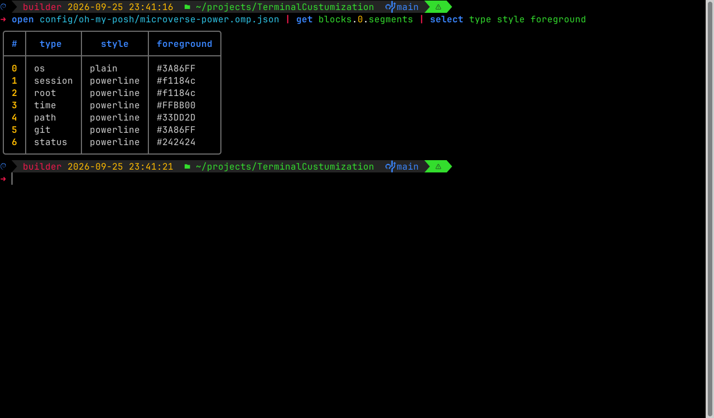

# Nushell – the default shell

<https://www.nushell.sh> · <https://github.com/nushell/nushell> · [Nushell Book](https://www.nushell.sh/book/)



Nushell (`nu`) is a modern shell where commands output **structured data** (tables and records)
instead of plain text. This setup opens Nushell automatically in every new terminal.

## How it starts automatically

| OS | Mechanism | How to opt out |
|----|-----------|----------------|
| Windows | Windows Terminal profile **Nushell (Microverse)** is set as the default profile, and a PowerShell window opened normally hands over to `nu` (the PowerShell profile runs it) | `install.ps1 -NoDefaultShell` (PowerShell stays PowerShell), `$env:TC_NO_NU=1` for one session, or pick another Terminal profile in *Settings → Startup → Default profile*; `install.ps1 -DefaultShell` switches back |
| Linux | `~/.bashrc` hands off to `nu` for interactive terminals (`exec nu`) | `TC_NO_NU=1 bash` for one session; `install.sh --skip-tools --skip-fonts --no-default-shell` (or `touch ~/.config/terminal-customization/no-nu`) permanently; `--default-shell` switches back |

Typing `bash`, `pwsh` or `powershell` inside Nushell gives you that shell (no loop); `exit` returns to Nushell.
PowerShell started to run something (`-Command`, `-File`: the Visual Studio Developer PowerShell, VS Code, scripts) never
switches to Nushell.
Your login shell stays bash, so scripts and system tools are not affected.

## Install

| | Command |
|-|---------|
| Windows | `winget install Nushell.Nushell --source winget` |
| Linux | download `nu-<version>-<arch>-unknown-linux-musl.tar.gz` from the [latest release](https://github.com/nushell/nushell/releases/latest) and copy `nu` to `~/.local/bin` (done by `install.sh`) |

## Configuration files

| File | Purpose |
|------|---------|
| `$nu.config-path` (`config.nu`) | your own settings; the installer appends a marked block that refreshes the oh-my-posh, zoxide and fzf integrations on start ([snippet](../../config/nushell/config-snippet.nu)) |
| `($nu.default-config-dir)/autoload/terminal-customization.nu` | colours, environment and aliases from [this repo](../../config/nushell/terminal-customization.nu) |
| `($nu.default-config-dir)/autoload/zoxide.nu`, `fzf.nu` | generated integration scripts |

Run `config nu` to edit `config.nu`, and `$nu.default-config-dir` to see the config folder.

## Aliases in this setup

Nushell's own `ls` and `du` are kept, because they return tables you can filter.

| Alias | Runs |
|-------|------|
| `l`, `ll`, `la`, `lt` | eza (plain, long, long + hidden, tree) |
| `cat` | `bat --paging=never` |
| `df` | `duf` |
| `z`, `zi` | zoxide jump / interactive jump |
| `Ctrl+T`, `Ctrl+R`, `Alt+C` | fzf: insert file, search history, cd into directory |

## Everyday Nushell

```nu
ls | where size > 1mb | sort-by modified --reverse    # filter and sort files
ls **/*.rs | length                                    # count files recursively
ps | where cpu > 5 | select name pid cpu               # busy processes
open package.json | get dependencies                   # read JSON/YAML/TOML/CSV as data
open data.csv | where amount > 100 | to json           # convert between formats
http get https://api.github.com/repos/nushell/nushell | get stargazers_count
sys host                                               # system information
help commands | where name =~ str                      # discover commands
$env.PATH                                              # environment variables are data too
```

Differences from bash worth knowing: chain commands with `;` (there is no `&&`/`||`, use `try { }` or `if`),
set variables with `$env.NAME = value` instead of `export`, `^cmd` forces the external command instead of a
built-in (e.g. `^ls`), and `| lines` turns plain text output into a list.
